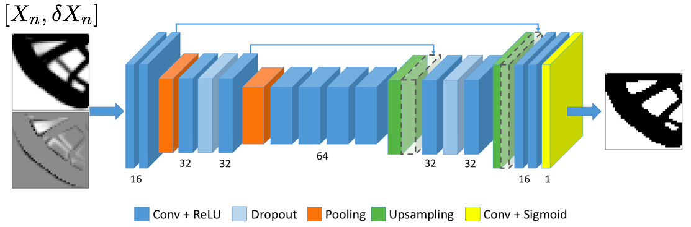

# Neural Networks for Topology Optimization
This is the code for the paper **I. Sosnovik, I. Oseledets "Neural Networks for Topology Optimization"**.
[[link](https://www.degruyter.com/view/j/rnam.2019.34.issue-4/rnam-2019-0018/rnam-2019-0018.xml)][[pdf](https://arxiv.org/pdf/1709.09578.pdf)]

*In this research, we propose a deep learning based approach for speeding up the topology optimization methods. The problem we seek to solve is the layout problem. The main novelty of this work is to state the problem as an image segmentation task. We leverage the power of deep learning methods as the efficient pixel-wise image labeling technique to perform the topology optimization. We introduce the convolutional encoder-decoder architecture and the overall approach of solving the above-described problem with high performance.*



## Preparations
We use [TOP dataset](https://github.com/ISosnovik/top) to train the model.

In order to work with dataset easier, we aggregate the files into one `.h5` dataset. 

```bash
python prepare_data.py --source SOURCE_FOLDER --dataset-path WHERE_TO_SAVE
```

## Training
You can train the model with script `training.py`. Here is the list of arguments:

* `--dataset-path` - path to `.h5` dataset
* `--input-size` - size of the input tensor. Default is `40`
* `--batch-size` - size of a minibatch. Default is `64`
* `--epochs` - number of training epochs. Default is `30`
* `--vol-coeff` - volume constraint coefficient in total loss. Default is `1.0`
* `--iter-sampler` - iteration sampler. Either `uniform` or `poisson_<LAM>`, where `LAM` is lambda in Poisson distribution. Default is `uniform`
* `--summary-prefix` - root folder to save the summary
* `--save-prefix` - root folder to save the model

Just type `bash experiments.sh` to run default experiments. 

Notebook `results.ipynb` demonstrates how to reproduce some of the results from the paper.

## Citation

If you use this code for your research, please cite 

	@article{sosnovik2017neural,
	  title={Neural networks for topology optimization},
	  author={Sosnovik, Ivan and Oseledets, Ivan},
	  journal={arXiv preprint arXiv:1709.09578},
	  year={2017}
	}
